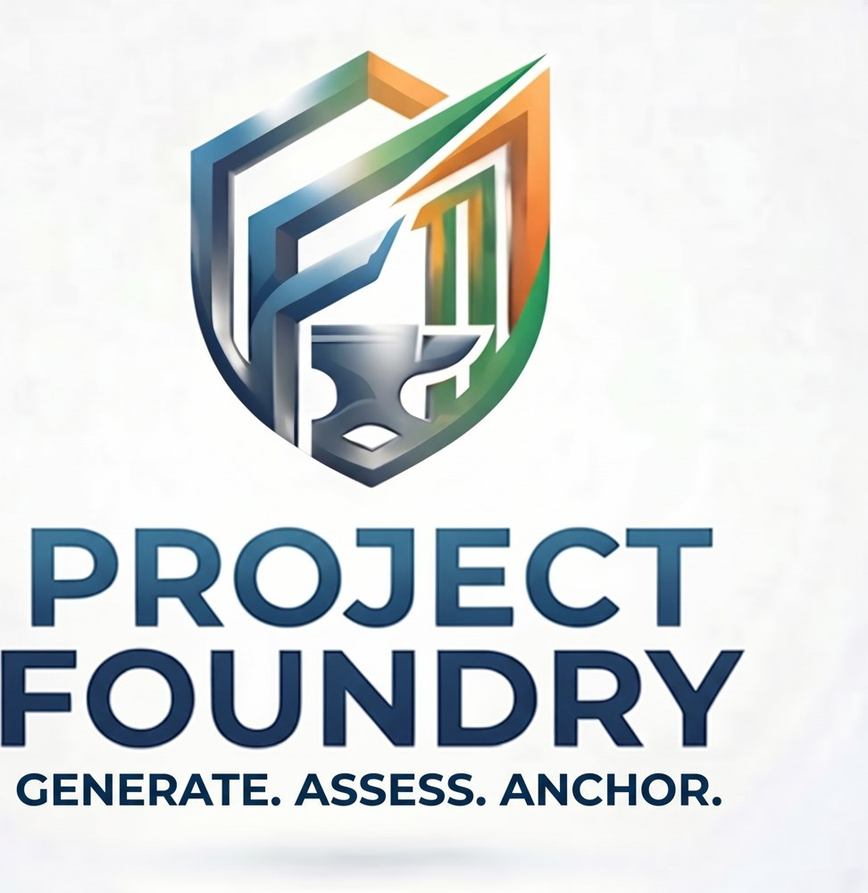

# Project Foundry: the proof economy

<p align="center"></p>

Read this in: English · [Bahasa Melayu](README.ms.md) · [简体中文](README.zh.md) · [தமிழ்](README.ta.md)

A proof of a circuit is a certificate. Certificates license into larger proofs
and into manufactured silicon, priced at a floor no competitor can match, and
settled on Arbitrum Stylus. Verification is shared, not repeated: a block is
proved once, in public, and every system built on it inherits the proof.

This repository is the public instance of that economy. It holds a free service
that tells foundry cells apart for a given net, the contracts that settle proofs on chain,
and the levels of proof every certificate is graded by. The scientific record
behind every number lives in [RESEARCH.md](RESEARCH.md).

## The levels of proof

Every certificate names the level at which its block is proved. The ladder runs
from the strongest bounded proof to the one that scales without bound. Above
the ladder sit the proofs that give it meaning and trust.

| Level | What it proves | How | Reach | Status here |
| --- | --- | --- | --- | --- |
| 1. Exhaustive | The block computes the right output for every input | Enumerate the whole input space (a cell's truth table in SPICE from the PDK transistors; an 8-bit adder over all 131,072 inputs) | Small blocks only; cost grows as 2 to the power of the input width | Proven: SPICE cell proofs, adder8 |
| 2. Equivalence | Two representations compute the same function | A SAT miter between netlist and RTL, temporal induction for sequential logic; symbolic, so no enumeration | Any block a solver can close | Proven: Yosys SAT |
| 3. Techmap onto proven cells | The netlist uses only cells proved at level 1 and is structurally equal to its RTL | Map to the proven library, then a structural equivalence check | Any block, bounded by a primitive cap of 64 cells per leaf | Proven |
| 4. Composition | A larger block is correct because it is built only from proven parts and proven glue, bound to its declared children | A census of the parts plus an equivalence of the assembly to the composition; the cap forces anything larger to decompose | Unbounded: a composite is a part for the next level | Proven: the scalable rung |

Composition is the top of the correctness ladder and it is closed: a composed
block is a part for the next composition, so the ladder scales indefinitely.
Three proofs sit above or beside it.

| Above the ladder | What it adds | Status here |
| --- | --- | --- |
| Refinement to specification | The composed system satisfies the standard it claims (IEEE 754 correct rounding, the RISC-V ISA), not merely equals its own RTL. This gives the top-level interface its meaning. | Roadmap: the next rung to build |
| Soundness of the composition rule | A machine-checked theorem that proven parts plus proven glue yield a proven whole, justifying level 4 for every instance at once | Roadmap |
| Proof-carrying trust and attestation | Proof certificates a verified checker replays, so no solver is trusted on its word; and the custody chain from proven design to fabricated silicon | Roadmap: sky130 shuttle commitment, November 4, 2026: content-addressed custody is proven, certificate replay and silicon attestation are roadmap |

Simulation with test vectors is evidence, not a proof. It is recorded, and it
never advances a certificate on its own.

## The economy

Two licenses ride on every certificate. The protocol takes zero in both.

**Reference: the commons.** Foundry PDK primitives are free to reference
forever. Every other certificate recovers only its listing gas, paid by the
abstractions that directly use it, capped at that gas, then it is free. Whoever
beats a block pays its listing cost. Cost recovery, never rent.

**Manufacturing: the designer's product.** The right to put a design into a
fabricated SoC. The design goes only to a designer-named foundry, which must
prove it received the committed package before it may consume a single unit.
The licensee never downloads the file. The price is a floor: $100 per mask set,
covering every certified block in that mask, walked down as adoption grows
until it converges on what a proof physically costs to produce and settle.

## The contracts

Three Arbitrum Stylus contracts, one per settlement mode.

| Contract | Mode | What the chain does |
| --- | --- | --- |
| q2-verifier | Re-verify | Re-runs a bounded proof on chain. Trustless. |
| q2-anchor | Anchor | Records a content-addressed commitment of an off-chain proof with an improvement label. |
| q2-composition | Compose and license | Certifies a larger system by reference to child certificates and settles both licenses. |

## Cell differentiation, free through a first fabrication run

The same function comes in many cells. sky130 ships its strongest buffer,
buf_16, in five standard-cell libraries, each built for a different job.
Describe a net (the load it drives, how often it switches, how long it rests)
and one open bench measures the candidates for it, free of charge to a team
through its first fabrication run.

```
  describe                  measure                            record
  load, switching    ==>    foundry netlists at pinned   ==>   bench + netlists +
  rate, rest time           commits, ngspice on the open       results hashed into
                            sky130 PDK, 3 corners x 3 loads    one anchor record
```

`python3 analysis/differentiate.py` measures buf_16 from sky130 hd, hdll, ls,
ms and hs: delay, energy per cycle, the energy it costs the driving stage,
leakage at rest, and laid-out area from the LEF. At the typical corner and
250 fF, hs is 26% faster than hd for 1.1% more energy per cycle, 78 times the
leakage, and 28% more area, so hs suits busy nets with tight timing and hd suits
nets that mostly rest. Every corner and load is in
[results/differentiate.md](results/differentiate.md); the anchor record for the
run is in results/differentiate.json.

## What is proven and what is roadmap

Proven: levels 1 to 4 of the ladder, the three contracts, a demo that runs a
real MXFP4 GEMM accelerator through both licenses, and a Lean proof package of
the economics. Roadmap: refinement to specification, the soundness theorem for
composition, certificate replay, and silicon attestation. The line between the
two is kept honest in [RESEARCH.md](RESEARCH.md).
